# Gas City Build Pack (`gc`)

This is the base pack for running full software-delivery workflows in Gas
City: gather requirements, write and review a plan, decompose into tasks,
implement in parallel agent sessions, review the result, and optionally
publish. It ships three things:

- **Workflow formulas** — `build-basic` (the starter factory), the
  `build-from-*` continuation entrypoints, direct `implement`, and GitHub
  adapter workflows (issue triage, issue fix, PR review).
- **The `gc.mayor` coordinator skill** — a user-facing planner that gathers
  requirements, writes plans, creates approved beads/convoys, and launches
  the right formula for you.
- **The `build-base` contract** — the virtual stage sequence that the
  methodology packs in this repository (bmad, compound-engineering,
  superpowers, gstack) extend and override.

## Quick Start: your first build

Prerequisites: Gas City installed and a city running (`gc init`, `gc start`),
and your project added as a rig (`gc rig add .` inside the repo). See the
[repository README](../README.md) for the from-scratch path.

1. Import formulas, claim command, and rig roles. From city directory:

   ```sh
   gc import add --name gc https://github.com/gastownhall/gascity-packs.git//gascity
   ```

   Then add rig-scoped roles in `city.toml` and run `gc import install`:

   ```toml
   [[rigs]]
   name = "your-project"

   [rigs.imports.gc]
   source = "https://github.com/gastownhall/gascity-packs.git//gascity/roles"
   ```

   Both imports are required. The rig-scoped roles pack supplies agents but,
   by design, rig imports do not register city commands; importing roles alone
   renders prompts that reference `gc gc claim` without installing that
   command. Keep the top-level Gas City pack imported at city scope.

   (Contributors hacking on packs can point this source at a local clone.)

2. Create a bead describing what you want built, and sling the starter
   factory at it:

   ```sh
   gc bd create "Add a --json flag to the export command"
   gc sling gc.run-operator <bead-id> --on build-basic \
     --var artifact_root=plans/json-flag/build
   ```

3. Watch it run. The workflow walks requirements → plan → plan review →
   decompose → parallel implementation → a three-lane starter review
   (acceptance, test evidence, simplicity) → finalize. Attach to any agent
   session with `gc session attach <name>`, or inspect the workflow root
   bead as stages record their artifacts.

4. Read the results under `artifact_root` in your rig: `requirements.md`,
   the implementation plan, review reports, and `factory-run.md` — a short
   summary of what ran, what was proven, and the suggested next action.

Prefer a guided experience? Run the coordinator skill instead and let it do
the planning and launching:

```text
Use skill gc.mayor
```

## Choosing an entrypoint

An idea or request is the input to the Software Development Lifecycle (SDLC).
The `build-from-*` continuation formulas are named for the point where they
enter it. For example, `build-from-requirements` starts at Requirements and
gathers requirements from the idea or request you provide.

Each full-lifecycle formula runs from its starting phase through a complete,
tested, and reviewed implementation with any required review fixes applied,
plus a final report. The result may remain local, be pushed, or be published
as a PR.

The SDLC phases are:

- Requirements
- Implementation Planning
- Plan Review
- Plan Decomposition into beads
- Implementation and Testing
- Implementation Review/Fix
- Finalization
- Optional Publication (push or PR)

| What you have | Public formula | SDLC phase you're starting from |
| --- | --- | --- |
| A target bead containing an idea or request | `build-basic` | Requirements |
| An idea or request, but no target bead | `build-from-requirements` | Requirements |
| An approved requirements (aka plan) Markdown file | `build-from-plan` | Implementation Planning |
| Approved requirements and a reviewed implementation plan | `build-from-decompose` | Plan Decomposition |
| A Gas City implementation convoy and its requirements, implementation plan, and decomposition | `build-from-convoy` | Implementation |

### Focused workflows

| What you want to do | Public formula | Successful output or boundary |
| --- | --- | --- |
| Harden an implementation plan | `design-review` | Revised implementation plan approved or blocked by its review loop |
| Implement an approved convoy without the full build suffix | `implement` | Implementation summary and optional publication; no normal review/fix/finalize suffix |
| Resume an existing Gas City build at implementation review | `build-from-review` | Full-lifecycle output described above; requires its upstream build artifacts and implementation evidence |
| Review an implementation | `review` | Review report only |
| Check requirements and implementation coverage | `gap-analysis` | Coverage report only |
| Assess a GitHub issue | `github-issue-triage` | Triage report and a sticky issue comment, created or updated; no implementation |
| Fix a GitHub issue | `github-issue-fix` | Implemented and reviewed issue fix; sticky issue-fix status comment created or updated; optional draft or ready PR |
| Review a GitHub PR | `github-pr-review` | Review report and a sticky PR comment for the current head, created or updated; no code changes, formal GitHub review, or merge |

The normal build continuations use one implementation-plan review gate; a required-changes or blocked verdict stops the continuation. `design-review` and `github-issue-fix` provide review loops that harden an implementation plan. Testing evidence is required; TDD is not. `gc.mayor` can gather the upstream artifact paths needed by the continuation formulas.

Discover everything that is launchable from the active rig/city context:

```sh
gc formula catalog --json
gc formula show implement --json
```

Launch implementation directly against an approved implementation convoy:

```sh
gc sling gc.run-operator <convoy-id> --on implement \
  --var context_path=<optional-context-yaml> \
  --var drain_policy=separate
```

## Launch variables that matter

Every build entrypoint accepts the same knobs. Set them with `--var k=v` at
launch or pin them in a rig's `formula_vars`:

| Variable | Default | What it changes |
| -------- | ------- | --------------- |
| `artifact_root` | (required) | Directory under the rig where all build artifacts land. |
| `interaction_mode` | `interactive` | `interactive` keeps blocking questions and approval menus; `autonomous` decides and records evidence; `headless` never prompts. |
| `review_mode` | `agent` | `report` is read-only findings; `agent` is a structured fix handoff; `interactive` may apply safe fixes directly. |
| `drain_policy` | `separate` | `separate` runs implementation beads in parallel worker sessions; `same-session` runs them serially in one shared session. |
| `implementation_target` | `gc.implementation-worker` | The rig role that implements each work item. |
| `push` / `open_pr` | `false` | Allow the publish stage to push and open a PR after all checks pass. |
| `max_iterations` | `10` | Bound on implementation/review fix attempts. |

When variables are not enough, every stage prompt can be replaced by dropping
a Markdown file at the same relative path in a higher-priority layer, and
every documented step can be swapped for your own expansion — see "Stable
Workflow Override Interface" below for the recipe and per-stage examples.

If part of the factory already ran, launch the targetless continuation
entrypoint that matches the artifacts you already have:

```sh
gc sling gc.run-operator build-from-decompose --formula \
  --var artifact_root=<artifact-dir> \
  --var requirements_path=<artifact-dir>/requirements.md \
  --var plan_path=<artifact-dir>/implementation-plan.md \
  --var plan_review_path=<artifact-dir>/plan-review.md \
  --var drain_policy=separate
```

Each continuation validates the artifacts you hand it before doing any work,
records the entrypoint it started from, and refuses to finalize as a pass when
review or repair is still blocked — see "Choosing an entrypoint" above for
which one matches the artifacts you have.

Every formula in this pack uses `contract = "graph.v2"`. Targeted formulas take
the core-injected reserved convoy target; they do not declare `issue`,
`bead_id`, or `convoy_id` variables. `drain_policy=separate` is the standalone
default. Use `same-session` only when preserving one shared worktree and
conversation is explicitly desired and core shared drain support is available.

The pack ships its city-scoped claim command alongside formulas, plus
providerless rig role agents under `gascity/roles`. Standalone use requires
the top-level `gc` import for formulas, mayor skill, and `gc gc claim`, and
`gascity/roles` on each target rig for `gc.*` role agents.

Import roles for each target rig. By default agents inherit city/workspace
provider; advanced users can patch individual roles without overriding formulas:

```toml
[[rigs]]
name = "my-repo"

[rigs.imports.gc]
source = "/path/to/gascity/roles"

[[rigs.patches]]
agent = "gc.implementation-worker"
provider = "your-provider"
```

Launch formulas from target rig context, or pass normal `--rig <target-rig>`
selection so `gc.run-operator` resolves to rig-local role.

Default formula routes use these qualified targets: `gc.run-operator`,
`gc.requirements-planner`, `gc.design-author`, `gc.task-decomposer`,
`gc.issue-triager`, `gc.design-implementation-reviewer`,
`gc.design-test-risk-reviewer`, `gc.review-synthesizer`,
`gc.implementation-worker`, `gc.gap-analyst`, `gc.implementation-reviewer`,
and `gc.publisher`.

## Worker workspaces

The unit of isolation is the agent. A rig role agent starts in the rig root
unless its `work_dir` says otherwise; in the standard model every role agent
that reads or writes a rig's source has one. gc creates the `work_dir`,
starts the session in it, exports it as `$GC_DIR`, and materializes the
agent's skills and hooks into it (because it differs from the scope root); a
`pre_start` command runs before the session, in `$GC_DIR`, with the session
environment (`GC_TRIGGER_BEAD_ID` for a slung bead), and makes that
directory a git worktree of the rig on the bead's branch. Workers never
choose, create, or hunt for a workspace, and the rig root stays a human
checkout that no agent touches. A role the city gave no `work_dir` still
starts in the rig root and has no lane; the role prompt then has it create no
worktree and write nothing there, whatever the rig's own rules say: it reads
by `git show` and `git log` only, and a step that needs a checkout closes with
`gc.outcome=fail` and `gc.failure_class=no-lane`, naming the fix, a lane for
the role (the `[[patches.agent]]` entry below). No prompt-side path makes a
workspace for an unconfigured role.

This pack ships `assets/scripts/worker-worktree.sh` for the `pre_start` half.
Copy it into the city's scripts directory, `.gc/scripts` (gc does not sync a
pack's `assets/scripts` there), and reference it through `{{.CityRoot}}`:

```sh
cp path/to/gascity/assets/scripts/worker-worktree.sh "$CITY/.gc/scripts/"
```

Wire the roles per city with `[[patches.agent]]` in `city.toml`, the
documented surface for overriding an imported pack agent's fields
(`work_dir` and `pre_start` are both patchable; `rig = "*"` reaches the role
in every rig; the bare role name matches the pack agent whatever import
alias the city gave it). One entry per role. Give the read-only roles
(reviewers, analysts, planners) a lane too, so no role ever starts in the
rig root; for them the script's reuse path is a fetch and a checkout.

```toml
# city.toml — every gc role agent starts in its own lane worktree.
[[patches.agent]]
rig = "*"
name = "implementation-worker"
work_dir = ".worktrees/{{.Rig}}/lane-{{.AgentBase}}"
pre_start = ["sh {{.CityRoot}}/.gc/scripts/worker-worktree.sh"]

# Repeat the entry for the other roles this pack ships: publisher,
# run-operator, review-synthesizer, design-author, requirements-planner,
# task-decomposer, issue-triager, implementation-reviewer,
# design-implementation-reviewer, design-test-risk-reviewer, gap-analyst.
```

A second role instance on another provider (an `agents/<name>/agent.toml`,
see the repository README, "Codex code workers") carries the same two keys
directly. `{{.AgentBase}}` is the agent identity gc resolves the session
under. A pool slot is named `<role>-<slot>`, so concurrent sessions of one
role get distinct lanes (`lane-gc.implementation-worker-1`,
`lane-gc.implementation-worker-3`, …) and never share a checkout; a singleton
agent (`max_active_sessions = 1`) keeps one lane across sessions, so the
script's reuse path (fetch, switch to the new bead's branch) applies.
`gc session list` shows each live session's work dir. A lane belongs to one
live session at a time and the branch is the handoff (below): a helper
session, a nested review or a second worker never writes into another
agent's lane, and the role prompt has a worker pin its lane before its
first write (`gc session list` shows it as the only live session with that
work dir; otherwise it writes nothing and mails the mayor).

The pack does not set these keys on its role agents by default. The
`pre_start` half needs the script installed in the city's `.gc/scripts`, and
a `pre_start` that fails aborts the session start by design, so a pack-level
default would stop every role session in a city that has not installed it;
which roles need filesystem isolation is a deployment decision in gc's
model. `gc doctor` reports a `pre_start` script referenced via
`{{.CityRoot}}` that is missing on disk.

The script makes `$GC_DIR` a worktree of `$GC_RIG_ROOT`'s repository and
never touches the rig root's working tree; the rig root, anything inside it,
and any ancestor of it are refused up front. Runs on one repository are
serialized by a lock in its git dir, so concurrent sessions cannot race on a
branch or a lane. With a trigger bead it reuses the one branch whose name
contains the bead id as a whole token (local or on the remote) or creates
`<bead id>` from a resolved base: `<remote>/HEAD`, else `<remote>/main`, else
`<remote>/master`, else the rig root's `HEAD` with a WARN (the remote is
`origin` unless `--remote` names another; `--base` overrides); a branch
checked out in another worktree is not stolen (the lane is left detached at
its tip, with a WARN). Nothing is
ever deleted: a lane with tracked modifications, or a non-empty directory
that is not a git checkout, is moved to `<lane>.aside-<utc stamp>` first; a
checkout of another repository is refused. Untracked files (materialized
skills, hooks, `node_modules`) do not count as modifications. `sh
worker-worktree.sh --help` prints the full contract.

The lane is on the bead's branch when the worker claims (a pooled session
with no trigger bead starts detached and takes the bead's branch itself after
the claim, below). With a gascity that
resolves the work branch from the session work dir (`hookClaimWorkBranchDir`,
the companion core change), `gc hook --claim` then stamps a correct
`gc.work_branch`; older builds read the rig root's branch, so the role prompt
has the worker compare `gc.work_branch` with its branch after the claim and
restamp it when they differ: the bead's branch is the one whose name contains
the bead id as a whole token (the `pre_start` rule), so a record naming
anything else is a claim-time stamp, and the worker never writes a fresh base
branch over a recorded item branch, which carries the bead's committed work.

Inside a formula the branch is also the handoff between lanes, under one
lifecycle: a lane holds the item's branch only while it is writing to it and
releases it (`git switch --detach`) when it hands off, because git allows one
worktree per branch; every reader inspects the recorded commit detached in its
own lane (`git switch --detach <commit>`, `git show <commit>:<path>`), so
parallel reviewers never contend and the fix lane finds the branch free.
Every read that resolves the item's branch to a commit names the full ref,
`refs/heads/<branch>` (`git log -1 "refs/heads/<branch>"`, `git rev-parse
--verify "refs/heads/<branch>"`), never the bare name: git resolves a bare
name tag-first, so a tag with the branch's name would send readers and review
to the base instead of the implementation; only the branch operand of `git
switch`, which resolves branches alone, stays bare, and a tracked take starts
from `refs/remotes/origin/<branch>`. A
branch left held by a crashed writer is released by the operator from that
lane, never by another agent's step. Every lane, writer or reader, proves it
is a lane before it switches or detaches anything (the three-part boundary
test in `do-work/prepare-worktree` step 4: the resolved top-level is `$GC_DIR`
itself, not the rig root or inside it, and the git common dir is the rig's);
a role with no `work_dir` starts in the rig root, and a reader there reads by
`git show` only and never detaches the human checkout. After the fix lane
commits it refreshes the recorded commit of the item it fixed (that source
anchor's record in the review context file and `gc.review_commit` on that
source anchor, never a workflow-wide key: separate drains put several items
on independent branches, each reviewed at its own commit) before it releases
the branch, so the next review attempt inspects the fixed code, not the
commit the setup saw, and the other items' recorded commits stay as they
were. A re-launched item keeps its branch: `pre_start` names a lane's branch
for the trigger step bead, so a new run puts the operator's lane on a fresh
step branch, and `do-work/prepare-worktree` reads the source anchor's
recorded `gc.work_branch` first and resolves the item's branch by name, the
one branch naming `<source-anchor-id>` as a whole token, local or on
`origin` (exactly one such branch is the item's whether or not the record
agrees; none means a new `<source-anchor-id>`; several fail closed for the
operator to reconcile), takes it in the operator's lane and records it only
when the record differs, never a fresh base branch over a recorded item
branch. A branch held by another worktree, a human checkout included, fails
the step closed with the holder named, and no checkout state, not the rig
root's branch nor a default branch, is consulted: the record on its own
decides nothing, because a claim-time stamp can name anything. The same
name rule binds a directly claimed bead: its branch is the one naming the
bead id, a worker whose `pre_start` had no trigger bead takes that branch
itself after the claim by the same listing (full ref names, one namespace
prefix removed), a worker whose `pre_start` found that branch held elsewhere
closes `gc.failure_class=branch-held` naming the holder instead of creating a
second candidate, and a branch recorded before this rule under a name
without the id is renamed by the operator before the rule is rolled out on a
city.

Two related core behaviors complete the picture:

- A bead carrying `work_dir=<absolute path>` metadata, assigned and in
  progress, starts its next session in that directory (an existing per-bead
  worktree wins over the agent's lane). The role prompt tells workers to stamp
  it, with `gc.work_branch`, before closing a bead whose work continues.
- Toolchain on the worker PATH belongs to the provider: `[providers.<name>]
  env = { PATH = "..." }` (values expand `$VAR` against the controller
  environment) or a command shim that prepends a directory of wrappers. The
  role prompt does not install package managers; the wrappers this pack
  ships for that directory are the next section.

## Worker toolchain

The directory a provider shim puts first on PATH (`CODEX_SHIM_PATH_PREPEND`,
or a `[providers.<name>] env` PATH) holds thin wrappers, and this pack ships
two in `assets/scripts/toolchain/`: `pnpm`, and `node` (installed three
times, as `node`, `npm` and `npx`; the name it is called by selects the
program). Each installs its tool ONCE under the city, in
`$CITY/.gc/toolchain/`, never machine-wide, and per-city settings live in a
`toolchain.env` beside the wrappers (plain `KEY=VALUE` lines, never
evaluated; a variable in the environment, even empty, wins over the file).
Each wrapper's full contract is the comment at its head.

```sh
mkdir -p "$CITY/.gc/shims/toolchain"
install -m 0755 path/to/gascity/assets/scripts/toolchain/pnpm "$CITY/.gc/shims/toolchain/pnpm"
install -m 0755 path/to/gascity/assets/scripts/toolchain/node "$CITY/.gc/shims/toolchain/node"
ln -sf node "$CITY/.gc/shims/toolchain/npm"
ln -sf node "$CITY/.gc/shims/toolchain/npx"
cat > "$CITY/.gc/shims/toolchain/toolchain.env" <<'EOT'
NODE_VERSION=24.21.0
PNPM_VERSION=11.20.0
EOT
# outside any sandbox, once, so the first worker command is not the install:
(cd "$CITY" && export PATH="$CITY/.gc/shims/toolchain:$PATH" && node --version && pnpm --version)
```

The installed copies are city runtime state; the files here are their
source of record. Record each canonical md5 once, from the pack checkout at
the installed pin, and compare the installed file to the literal (a missing
file or a missing md5 tool then fails the check instead of matching an empty
string; `md5sum` on Linux prints the same hash first):

```sh
canonical=$(mktemp) && git -C path/to/gascity-packs show <pin>:gascity/assets/scripts/toolchain/pnpm > "$canonical" && md5 -q "$canonical"
canonical=$(mktemp) && git -C path/to/gascity-packs show <pin>:gascity/assets/scripts/toolchain/node > "$canonical" && md5 -q "$canonical"
test "$(md5 -q "$CITY/.gc/shims/toolchain/pnpm")" = <that md5>
test "$(md5 -q "$CITY/.gc/shims/toolchain/node")" = <that md5>
```

### pnpm: the lane install runs once, never inside a check

Measured on pnpm 11.20.0: `verify-deps-before-run` defaults to `install`, so
every `pnpm run`, `pnpm exec`, `pnpm test` and bare `pnpm <script>` first
re-runs `pnpm install` when `node_modules` is out of sync with the lockfile,
which is the state of a fresh lane and of a lane that just switched to a
branch with different dependencies. pnpm spawns that install by name through
PATH, and three parallel read-only checks (a test, a lint, a render) after
one branch switch each ran it against the same `node_modules`, racing on the
bin links (`ENOENT ... chmod .../node_modules/.bin/...`). From the
environment only `pnpm_config_verify_deps_before_run=false` reaches the
setting (any other value, and an `.npmrc` line, still install); the
`--config.verify-deps-before-run=error` flag is what makes pnpm answer
read-only, with `ERR_PNPM_VERIFY_DEPS_BEFORE_RUN` instead of an install.

The wrapper exports the `false` value for the command it runs and sorts
each command into one of three kinds by the first bare token after the
global options and the prefixes pnpm accepts (`recursive`/`m`, `pm`, `with
<runtime>`). Which option swallows which token is pnpm's own option table,
copied from the pinned `pnpm.mjs` (the nopt pass pnpm finds its command
with: the global options plus `add`'s and `install`'s, the universal
shorthands, unique prefixes, `--no-` negation, a boolean swallowing only a
literal `true`/`false`, `--` and the words `create`/`exec`/`test` ending the
options), so `pnpm --filter app install`, `pnpm --child-concurrency 1
install` and `pnpm --recursive false install` are installs, and the flags
the wrapper acts on are read again with the command's own table, as pnpm
reads them:

- **info** (`store`, `config`, `list`, `outdated`, `--version`, `help`, ...,
  and any command whose last `-h`/`--help`/`-v`/`--version` in pnpm's option
  scope is on; `--no-help`, `--help=false` and `--help --no-help` ask for
  none, `--no-help --help` asks, as pnpm's parser keeps the last value) runs
  as is and touches no lock.
- **mutate** (`install`, `ci`, `add`, `remove`, `update`, `link`, `prune`,
  `dedupe`, `rebuild`, `clean`, `purge`, ... every pnpm 11.20 built-in that
  can change `node_modules`) runs where typed, arguments unchanged, under
  the lane lock, so it never overlaps another caller's install. A package
  script named `clean`, `purge`, `rebuild` (`rb`), `setup` or `deploy` in
  the manifest of the directory pnpm acts on wins over the built-in for
  pnpm, so it is a project command here too, unless `pnpm pm <name>` forces
  the built-in; an empty script (`"clean": ""`) is no script to pnpm and
  none here.
- **project** (`run`, `exec`, `test`, a bare script or bin name, anything
  else) first makes sure the lane is in sync, then runs.

In sync is pnpm's own word, never the wrapper's: before a project command
the wrapper asks pnpm read-only, in the directory pnpm will act on, with
`--config.verify-deps-before-run=error` and a command that runs nothing
(`pnpm exec true`). pnpm's `checkDepsStatus` compares `node_modules` with
the lockfile, every manifest, the workspace membership and the settings, and
answers yes or no (a missing `node_modules` included); any other failure
(a broken manifest; a denied write to pnpm's workspace state file on a
read-only lane, which pnpm reports under the same error code with the file
error as its reason, measured: `[ERR_PNPM_VERIFY_DEPS_BEFORE_RUN] EACCES:
permission denied, open '…/.pnpm-workspace-state-v1.json.…'`, so a reason
that is a system error code is no verdict either) is no verdict: one WARN
and the command runs as is, never an install. The question is asked under
the lane lock, `node_modules/.gc-lane-deps.lock` (a mutate or install in
flight holds it, and a `rebuild` half done still reads as yes to pnpm, so
it is waited for first). Yes: the lock is released and the command runs,
holding nothing. No: the caller, still under the lock in the lane
(the workspace root above the target, the nearest `pnpm-workspace.yaml`,
because a workspace install writes every member's tree whatever
`sharedWorkspaceLockfile` says; else the nearest `pnpm-lock.yaml`; under
`--ignore-workspace`, pnpm's "this directory is a standalone project", the
lane is the target directory itself when it holds `pnpm-lock.yaml`, and the
question and the install carry the flag, so a fixture project inside a
workspace is prepared as itself, never its parent; a project command with
no lane runs as is), runs `pnpm install --frozen-lockfile` in the lane,
releases, and runs; concurrent callers wait for the lock and ask pnpm
again, so a lane is installed once whatever runs in parallel. That is the
wrapper's whole concurrency contract (shape A, the mayor's decision after
gate rounds 19 to 29 each found a hole around a reader/writer model of
running commands): it owns its own question and the one frozen install per
lockfile, under the lane lock, and mutate-vs-mutate serialization, two
callers that both change dependencies (`install`, `add`, `remove`,
`update`, `dedupe`, `import`, `link`, `unlink`, `prune`, `patch`,
`rebuild`, and the other mutating built-ins in pnpm's own command table)
serializing on that same lock; a project command (`run`, `exec`, `test`, a
script or bin name, `dlx`, any non-mutating command) runs after the
question with no token of any kind, and nothing tracks running commands.
**Non-goal:** A running command is not fenced from a dependency mutation
another caller starts afterwards. This is bare pnpm's own position, and
under the lane model one lane belongs to one agent (memory
dispatch-worktree-constraint), so the two callers are the same agent. That
names `pnpm run build` under `syncInjectedDepsAfterScripts` (pnpm writes
injected dependencies and bin links after the script: a writer holding no
lock, unfenced by design) as much as `node check.js & pnpm rebuild`. A
command a running project command starts is any other caller: a project
command asks pnpm again under the lock, a mutate takes the lock and runs,
under the command that started it. A lane whose `node_modules` refuses the
lock for this caller (a sandbox, a read-only checkout) cannot be
coordinated from here, its question and install serialize on that lock, so
the command fails closed at once naming the refusal;
`GC_TOOLCHAIN_LANE_DEPS=off` runs there when the lane is this caller's
alone. A failed install fails the
command (the requested check never runs against a half-installed tree);
pnpm fails the frozen install closed when a manifest is ahead of the
lockfile, and the worker's own `pnpm install` (a mutate) resolves that.
Three gate rounds showed why the wrapper keeps no marker of its own: a
lockfile hash, then a manifest fingerprint, then a workspace enumeration
each re-implemented a part of pnpm's definition and each missed a case pnpm
already covers (`install --lockfile-only`, a cleanup built-in, a new
workspace package). The question costs one pnpm start (about a third of a
second) per project command.

The directory pnpm acts on is the last `-C`/`--dir`/`--config.dir=` value
in pnpm's own option scope, else the last `--prefix` (`--dir` wins wherever
it stands beside `--prefix`, measured; `--config.prefix=` and
`--config.workspace-root=` are not read by pnpm) (the whole line for a built-in; for `run` up to
the script name, whose own arguments are its own; nothing after `exec`,
`test` or `create`, whose next token is the bin or script name whatever it
looks like, measured: `pnpm exec -C x vitest` is 'Command "-C" not found';
a bare script name ends it), resolved against the working directory, else
the working directory itself. A lock whose owner is dead is moved aside by rename
(nothing deleted). Every change of hands of the lock goes through one gate,
`.gc-lane-deps.lock.reclaim` (mkdir, held for an instant): making the lock
(the mkdir and the pid inside as one step, with HUP, INT and TERM held for
it) and judging a stale lock and moving it aside, so a waiter cannot make a
fresh lock while another judges the old one, two waiters cannot both clear
it, and a lock that under the gate names another owner than the one judged
dead is never moved; a gate left standing for two minutes (a wrapper killed
outright inside it) fails the command closed for a human to remove. A live
lock is waited for (`LANE_DEPS_WAIT`, default 600 s) and then the command
fails closed naming the holder; a lock that cannot be made at all
(`node_modules` refusing the write under a sandbox, or the pid file it
records the owner in) fails the command at once with the refusal, leaving
no lock standing; a failed frozen install fails the command with pnpm's own
exit status; only the pid that took a lock releases it, and the making and
the releasing of the lock and the gate each run with HUP, INT and TERM held
(a signal in that instant is lost, never a lock left standing). The lock records the wrapper's pid, and
the dead-wrapper window is accepted, not chased: a wrapper killed outright
(SIGKILL) while its pnpm child still runs leaves a lock whose owner is dead,
the next caller reclaims it and may run beside the orphaned child; a signal
the wrapper traps (HUP, INT, TERM) releases the lock only after the child
has ended, as `sh` runs a trap after the foreground command completes
(measured). No child-pid tracking, no ancestor exemption. A lifecycle
script the mutation itself
runs (a `postinstall` that calls `pnpm run build`) re-enters the wrapper
with `GC_TOOLCHAIN_LANE_DEPS_INSTALLING=<lane>` set by its parent and runs
as info instead of asking pnpm or waiting on its parent's lock. pnpm itself
is installed once per version, under `<toolchain>/pnpm/v<version>/`, so a
changed `PNPM_VERSION` is a fresh install, never a stale cache (an older
unversioned `<toolchain>/pnpm/` from a previous wrapper is left alone). To
take even the first lane install out of the worker's first check, a city can
pre-warm the lane in `pre_start` after the worktree script, with
`[session] setup_timeout` raised to cover a cold install:
`"{{.CityRoot}}/.gc/shims/toolchain/pnpm exec true"`.

### node: a Node the repository accepts, without touching the machine's

The wrapper picks a version from `GC_TOOLCHAIN_NODE_VERSION`, else the
nearest `.nvmrc` / `.node-version` above the working directory (`24`,
`24.21`, `24.21.0`, with or without `v`; `lts/*` is skipped with a WARN),
else `NODE_VERSION` in `toolchain.env`; with none it is transparent and runs
the next `node` on PATH. A major resolves to the newest matching install
under the toolchain, else the newest matching release in
`<dist>/index.json`. A missing version is downloaded once from
`https://nodejs.org/dist` (`GC_TOOLCHAIN_NODE_DIST` overrides; `file://`
works), checked against that release's `SHASUMS256.txt` before extraction,
staged beside the target and renamed into place under a lock other callers
wait for (owner pid inside; an interrupted install's lock, its owner dead
or absent for two minutes, is moved aside by rename under a second reclaim
lock after a re-read, the same shape as the pnpm lane lock, so two waiters
never clear it twice and one tree is installed). When the pin cannot be installed (no network, the toolchain
directory not writable as under a sandbox, a checksum mismatch, installs
off), the wrapper prints one WARN and falls through to the next `node` on
PATH, so a toolchain error strands no session. The selected install's `bin`
goes first on PATH before the program runs, so `npm` and `npx` (`#!/usr/bin/env
node` scripts) find the selected node even when called by absolute path with
no node on the caller's PATH. pnpm's own bin resolves
`node` through PATH and the pnpm wrapper puts this directory first, so pnpm
and every script it runs use the pinned Node.

Say in the city's notes what the machine has and what the wrapper selects.
On the city this was built for: Homebrew `node` is v25.9.0, outside the
rig's `engines` range `^22.13.0 || ^24.0.0 || >=26.0.0` (every pnpm command
printed `Unsupported engine`); the Codex CLI's bundled runtime is v24.19.0
but belongs to Codex; `toolchain.env` pins 24.21.0 (the current 24 LTS), and
a `.nvmrc` in the repository, when it lands, wins over that pin.

### Codex review sandbox and local listeners

A worker's own `codex review --base origin/main` runs inside codex's
workspace-write sandbox even when the session itself was started with
`--dangerously-bypass-approvals-and-sandbox`, so a fixture that listens on
127.0.0.1, or on a unix socket under `TMPDIR` (tsx's IPC pipe), fails with
`EPERM` there while the same suite passes in the session. Measured on
codex-cli 0.153.4, driving a listener through real `codex exec` runs: no
configuration grants loopback binding without egress. `network.allow_local_binding=true`
alone, with `features.network_proxy=true`, with `network.mode="limited"` and
an empty domain list, and under `sandbox_mode="read-only"` all still deny the
TCP and the unix-socket listen; `sandbox_workspace_write.network_access=true`
is the egress switch, which a review must never gain. The decision is the
documented skip marker plus parent evidence:

- codex sets `CODEX_SANDBOX=seatbelt` and `CODEX_SANDBOX_NETWORK_DISABLED=1`
  in every sandboxed command. A fixture that needs a local listener skips
  under `CODEX_SANDBOX_NETWORK_DISABLED=1` (vitest: `it.skipIf(...)`), and
  the repository's test contract names that marker (a repository change,
  owned by the repository's own bead).
- The review takes the session's evidence as input: run the suite in the
  session first, then hand the log path to the review as its prompt
  (`codex review --base origin/main "Tests ran in the parent session: see
  <path>. Do not start listeners."`). The gate helper a city runs with `-s
  read-only` (`codex-gate.sh`) is already a read-only reviewer that runs no
  suite; its header should say that listener-bound tests are parent
  evidence, never gate work.

The trade-off: a sandboxed review cannot prove a listener-bound test itself;
it reads the session's log. The alternative, network egress for the review,
is rejected.

### Running this pack's tests

`make test` at the repository root runs the pytest suites CI runs
(`python3 -m pytest` when pytest, PyYAML and jsonschema import, else `uv run
--with pytest --with pyyaml --with jsonschema`), and `make test-gascity`
runs only `tests` and `gascity/tests`. Both unset `GC_TEMPLATE`, which a gc
worker session exports and one claim-command test would otherwise inherit.
A city's role prompt for this repository names the same target in its test
paragraph, so no worker rediscovers the runner.

## Build Methodology Contract

`build-base` is the virtual full-lifecycle workflow contract. It defines the
stable stage sequence that concrete build methodology packs can override:

```text
prepare -> requirements -> plan -> plan-review -> decompose ->
implement | implement-same-session -> review -> finalize -> publish
```

`build-base` is internal and should not be launched directly. Use
`build-basic` for the default Gas City implementation. It maps the base stages
onto the existing Gas City requirements, implementation-plan, design-review,
create-beads, implementation, post-implementation review, and publish helpers.
Gap-analysis is a review lens inside the post-implementation review loop, so
coverage findings are synthesized and fixed with the rest of the review output.

Continuation bases are nested suffixes. Each base validates its prerequisite
inputs, performs one stage or handoff, and delegates to the next suffix:

```text
build-from-requirements-base
  -> build-from-plan-base
  -> build-from-decompose-base
  -> build-from-convoy-base
  -> build-from-review-base
```

The cataloged `build-from-*` formulas are thin default Gas City wrappers around
those bases. Methodology packs that want the same entrypoints should extend the
matching `build-from-*-base` formula and override selector defaults, routes,
drain item formulas, or review expansions instead of copying the suffix graph.

Third-party methodology packs can extend `build-base` and override only the
stages they need. For implementation, packs should keep the Gas City drain
lifecycle and point the two static drain steps at pack-specific item formulas
that extend `do-work` and `do-work-item`. The repository currently ships
concrete vendored implementations for Compound Engineering, Superpowers, BMAD
Method, and garrytan/gstack. Those packs import this pack as `gc` internally,
so users can import one methodology pack at city scope while keeping the
existing `gc.*` role override surface for rig agents.

Third-party packs should treat upstream agent definitions, prompts, and skills
as vendored methodology inputs, not as runtime authority. When an upstream
methodology says to spawn subagents, dispatch a task tool, or run a plugin
command, the pack should convert that shape into a Gas City formula or expansion
with explicit `gc.*` lanes. The model may read the upstream persona or prompt
file for behavior, but work routing, retries, persistence, and fanout/fanin must
remain in the Gas City graph.

Raw-framework subagents become Gas City fanouts. That is the core rule for
methodology packs: preserve the user-visible process, reviewer perspective, and
handoff order, but make the routing durable through beads, drains, formulas, and
expansion children. Structured step-file prompts are usually good candidates for
separate formulas or expansion loops because Gas City can then retry, observe,
and resume each step independently.

Use two mode concepts when designing or launching methodology formulas:

- `interaction_mode` controls human participation in planning and gates.
  `interactive` preserves blocking questions and approval menus, `autonomous`
  lets the workflow make reasonable decisions while recording evidence, and
  `headless` is for automation with no blocking prompts.
- `review_mode` controls review authority. `report` is read-only output for
  adapters such as GitHub PR comments, `agent` is a structured machine handoff
  whose caller applies fixes, and `interactive` preserves a raw top-level review
  experience that may apply safe fixes when the methodology allows it.

The current cross-framework audit and follow-up proposal lives in
[`docs/design/build-methodology-framework-audit.md`](../docs/design/build-methodology-framework-audit.md).

## Requirements Ledgers

This base pack keeps product requirements beside the formula implementation:

- `REQUIREMENTS.md` defines the build methodology base contract and the default
  `build-basic` implementation expectations.
- `formulas/REQUIREMENTS.md` contains one durable behavior row for every base
  pack formula.

When a base formula's stage order, selector variables, drain behavior, artifact
contract, fanout/fanin, review loop, adapter side effect, or catalog surface
changes, update the matching requirements row in the same change. The formula
asset tests fail if a formula exists without a requirements row.

## Build Flow

`build-base` is the virtual contract. `build-basic` is the concrete Gas City
implementation that demonstrates the override surface without vendoring a
third-party methodology.

```mermaid
flowchart TD
    classDef base fill:#eef2ff,stroke:#4f46e5,color:#111827;
    classDef basic fill:#ecfdf5,stroke:#059669,color:#111827;
    classDef infra fill:#fff7ed,stroke:#d97706,color:#111827;
    classDef terminal fill:#f9fafb,stroke:#6b7280,color:#111827;

    Start["Launch build-basic<br/>or child of build-base"]:::terminal --> Prepare["prepare<br/>build-base contract"]:::base
    Prepare --> Requirements["requirements<br/>build-basic override<br/>gc.requirements-planner"]:::basic
    Requirements --> Plan["plan<br/>build-basic override<br/>gc.design-author"]:::basic
    Plan --> PlanReview["plan-review<br/>build-basic design review"]:::basic
    PlanReview --> PlanGate{"plan approved?<br/>design-review contract"}:::infra
    PlanGate -->|no: revise plan/review artifact| Plan
    PlanGate -->|yes| Decompose["decompose<br/>build-basic task beads"]:::basic
    Decompose --> Convoy["implementation convoy<br/>bead dependency graph"]:::infra
    Convoy --> DrainChoice{"drain policy<br/>Gas City drain"}:::infra
    DrainChoice -->|separate| DrainSeparate["separate drain<br/>parallel by convoy deps"]:::infra
    DrainChoice -->|same-session| DrainShared["same-session drain<br/>single worker lane"]:::infra

    subgraph ItemFormula["do-work item formulas: one formula instance per implementation bead"]
        direction TB
        SeparatePrep["prepare-worktree<br/>do-work"]:::base --> Implement["implement owned work<br/>gc.implementation-worker"]:::basic
        SharedImplement["implement shared item<br/>do-work-item"]:::base
        Implement --> CloseItem["close source anchor<br/>do-work"]:::base
    end

    DrainSeparate --> SeparatePrep
    DrainShared --> SharedImplement
    CloseItem --> DrainFanIn["fan in<br/>drain waits for all item roots"]:::infra
    SharedImplement --> DrainFanIn

    DrainFanIn --> Review["review<br/>build-basic implementation review"]:::basic

    subgraph ReviewLoop["post-implementation review loop: build-basic single-lane default"]
        direction TB
        Review --> ReviewLens["implementation review<br/>single reviewer lane"]:::basic
        ReviewLens --> ReviewReport["synthesize findings and required fixes"]:::basic
        ReviewReport --> ApplyFixes["apply required fixes when needed"]:::basic
        ApplyFixes --> ReviewGate{"implementation approved?<br/>review contract"}:::infra
        ReviewGate -->|no: fix and re-review| ReviewLens
        ReviewGate -->|yes| ReviewDone["review approved"]:::basic
    end

    ReviewDone --> Finalize["finalize<br/>build-basic summary"]:::basic
    Finalize --> Publish["publish<br/>build-basic or build-base no-op/push/PR"]:::basic
    Publish --> Done["workflow complete"]:::terminal
```



Blue nodes are the base contract or inherited item lifecycle, green nodes are
the concrete `build-basic` implementation, and amber nodes are Gas City graph,
convoy, or drain infrastructure. Concrete methodology packs extend the same
shape: they can override requirements, planning, review fanout, item formulas,
or finalization while preserving the convoy/drain/fan-in mechanics. The
`build-basic` review step is intentionally single-lane; packs such as
Superpowers, Compound Engineering, and BMAD replace it with expansion formulas
whose reviewer beads fan out before synthesis.

## Stable Workflow Override Interface

This section is the external compatibility promise for this pack's workflow
customization surface. The pack exposes two stable customization modes:

1. **Basic asset shadowing.** Put a Markdown file at the same relative path in a
   higher-priority city or local pack layer. Formula step bodies live at
   `assets/workflows/<formula>/<step-id>.md`. Gas City resolves these
   `description_file` assets through the normal import/layer search path, so the
   shadowing file replaces the base prompt text without changing the formula
   graph.
2. **Advanced step override.** Copy the formula into a higher-priority formula
   layer and replace the documented step block. Preserve the formula name, vars,
   metadata keys, dependency edges, and sink contracts that downstream steps
   still depend on. Use this when you need to replace one step with another
   formula, an expansion, a wider fanout, a retry loop, or a different agent
   route.

Only the override points below are intended as stable public interfaces. Other
steps may be useful to inspect, but they are implementation details unless they
are listed here.

When overriding a step that writes a downstream artifact, keep the artifact
contract stable:

- Verdict reports must use `schema: gc.verdict-report.v1` with
  `verdict: pass|fail`.
- GitHub issue triage reports must use `schema:
  gc.github-issue-triage-report.v1`.
- GitHub adapter workflows must preserve the documented `gc.github.*` metadata
  on the workflow root bead.
- Build and implementation workflows must not close the input convoy head unless
  the base step explicitly does so.
- Steps that only validate context must not mutate source files.

### GitHub Issue Triage

Use this when you want project-specific triage instructions for issue labels,
severity, evidence requirements, or public comment style.

Stable basic override:
`assets/workflows/github-issue-triage-base/write-triage-report.md`

Stable advanced step:
`github-issue-triage-base` step `write-triage-report`

Basic example: local label and severity policy.

Create `assets/workflows/github-issue-triage-base/write-triage-report.md` in
your city assets:

```markdown
Apply the repository triage policy before writing `triage-report.md`.

- If the issue touches `internal/api/`, `docs/schema/openapi.*`, or generated
  dashboard client types, read `engdocs/architecture/api-control-plane.md` and
  `engdocs/contributors/huma-usage.md` before assigning priority.
- Mark `needs_info` when the report lacks a reproduction, failing test, stack
  trace, linked CI artifact, or exact version. Do not invent a reproduction.
- Use priority `p1` only when current `origin/main` is affected or data loss is
  plausible. Use `p2` for historical release-only regressions unless security
  or data integrity is involved.
- Include suggested GitHub labels in the human-readable body, but keep the YAML
  front matter limited to the schema accepted by the validator.
```

Advanced example: replace triage with a two-lane evidence pass and synthesis.

Copy `github-issue-triage-base.formula.toml` into your local formula layer and
replace only `write-triage-report`:

```toml
[[steps]]
id = "write-triage-report"
title = "Run product and engineering triage"
needs = ["reuse-current-body-hash"]
expand = "company-github-issue-triage-quorum"
metadata = { "gc.run_target" = "gc.review-synthesizer" }
```

The expansion should read the same `gc.github.snapshot_path` and write the same
`triage-report.md` under `gc.github.triage_dir`. It may run separate product and
engineering lanes, but its sink must still validate as
`gc.github-issue-triage-report.v1` so `render-comment`, human gating, and
`post-comment` continue to work.

### Requirements Planning

Use this when issue-fix requirements need local acceptance criteria, release
policy, customer-impact language, or compatibility constraints.

Stable basic override:
`assets/workflows/github-issue-fix-base/generate-requirements.md`

Stable advanced step:
`github-issue-fix-base` step `generate-requirements`

Basic example: require W6H and example-mapping coverage.

Create `assets/workflows/github-issue-fix-base/generate-requirements.md`:

```markdown
Generate requirements using the local planning standard.

- Include Who, What, When, Where, Why, and How sections.
- Add an Example Mapping section with at least one happy path, one negative
  path, and one edge case tied to the GitHub issue evidence.
- Call out compatibility constraints for existing CLI flags, persisted bead
  metadata, and public GitHub comments.
- Do not approve implementation until every acceptance criterion can be tested
  by a unit, integration, or explicit manual verification step.
```

Advanced example: route requirements through a policy gate.

Copy `github-issue-fix-base.formula.toml` and replace
`generate-requirements`:

```toml
[[steps]]
id = "generate-requirements"
title = "Generate policy-gated requirements"
needs = ["update-status-started"]
expand = "company-requirements-with-quality-gate"
metadata = { "gc.run_target" = "gc.requirements-planner" }
```

The replacement should still write the requirements artifact path back to the
workflow root metadata key expected by later implementation-plan and
create-beads steps. It may add policy review, customer-impact review, or
approval lanes before closing.

### Implementation Plan

Use this when implementation plans need local architecture constraints,
migration rules, rollout notes, or repository-specific boundaries.

Stable basic override:
`assets/workflows/github-issue-fix-base/implementation-plan.md`

Stable advanced step:
`github-issue-fix-base` step `implementation-plan`

Basic example: enforce architecture docs for API changes.

Create `assets/workflows/github-issue-fix-base/implementation-plan.md`:

```markdown
Before writing or updating `implementation-plan.md`, classify the affected area.

- For `internal/api/`, CLI API-client code, SSE events, generated OpenAPI, or
  dashboard generated types, read `engdocs/architecture/api-control-plane.md`
  and `engdocs/contributors/huma-usage.md`.
- Include a "Wire Contract" section explaining request/response/event type
  changes and generated-code impact.
- Include a "Migration and Rollback" section for persisted metadata,
  database-like state, or external GitHub comments.
- If the plan adds framework logic that could belong in prompt/config, call
  that out and choose the prompt/config path unless there is a clear SDK
  primitive requirement.
```

Advanced example: replace the single-author implementation plan with
architecture and test-risk lanes.

Copy `github-issue-fix-base.formula.toml` and replace `implementation-plan`:

```toml
[[steps]]
id = "implementation-plan"
title = "Write implementation plan through architecture quorum"
needs = ["generate-requirements"]
expand = "company-architecture-design-quorum"
metadata = { "gc.run_target" = "gc.design-author" }
```

The expansion can fan out to architecture, operations, and test-risk authors,
then synthesize one `implementation-plan.md`. The sink must still publish the
implementation-plan path in the same workflow-root metadata used by
`design-review` and `create-beads`.

### Design Review

Use this when implementation plans need stricter approval rules or a broader
review group before bead creation begins.

Stable basic override:
`assets/workflows/design-review/design-review.md`

Stable advanced steps:
`design-review` step `design-review`; `github-issue-fix-base` step
`design-review`

Basic example: require security and operability review notes.

Create `assets/workflows/design-review/design-review.md`:

```markdown
Review the implementation plan with local release-readiness expectations.

- Security-sensitive input, auth, GitHub token use, filesystem writes, and shell
  execution require explicit threat notes.
- Operational changes need rollback, observability, and failure-mode notes.
- Implementation plans that affect persisted bead metadata must identify the metadata keys,
  migration behavior, and how old runs remain readable.
- Approve only when required changes are applied to the implementation plan, not
  deferred to implementation.
```

Advanced example: replace the design review step with an N-wide review loop.

Copy `design-review.formula.toml` and replace `design-review`:

```toml
[[steps]]
id = "design-review"
title = "Run architecture, security, and test plan quorum"
expand = "company-design-review-n-wide"
metadata = { "gc.scope_ref" = "body", "gc.scope_role" = "member", "gc.on_fail" = "abort_scope", "gc.run_target" = "gc.review-synthesizer" }
```

The replacement may create separate review artifacts, but `finalize` should
still be able to determine whether the implementation plan is approved or
blocked and write the terminal notification expected by the base workflow.

### Create Beads

Use this when task breakdown needs local slicing rules, dependency conventions,
or bead/convoy naming standards.

Stable basic override:
`assets/workflows/github-issue-fix-base/create-beads.md`

Stable advanced step:
`github-issue-fix-base` step `create-beads`

Basic example: enforce vertical slices and dependency hygiene.

Create `assets/workflows/github-issue-fix-base/create-beads.md`:

```markdown
Create runnable implementation beads from the approved implementation plan.

- Prefer vertical slices that each produce a testable behavior change.
- Do not create "refactor first" tasks unless the implementation plan
  explicitly requires the refactor as a prerequisite for user-visible behavior.
- Every task must identify expected files or modules, acceptance checks, and
  dependencies on earlier tasks.
- Use nested `convoys[]` and `beads[]` in `tasks.md`; never use `epics[]`.
```

Advanced example: replace bead creation with quality-gated task generation.

Copy `github-issue-fix-base.formula.toml` and replace `create-beads`:

```toml
[[steps]]
id = "create-beads"
title = "Create quality-gated implementation convoy"
needs = ["design-review"]
expand = "company-create-beads-with-architect-review"
metadata = { "gc.run_target" = "gc.task-decomposer" }
```

The expansion can draft tasks, run a bead-creation quality gate, revise until
approved, create the task beads and convoy, and record the created mapping. It
must still produce the `tasks.md` shape consumed by
`assets/scripts/create_beads_from_tasks.py` and record the created convoy
metadata expected by downstream build dispatch.

### Post-Implementation Review

Use this when the build needs different post-implementation review evidence,
review lanes, synthesis, or fix policy. Gap-analysis belongs in this review
fanout instead of running as a separate lifecycle stage.

Stable basic override:
`assets/workflows/build-basic/review.md`

Stable advanced steps:
`build-base` step `review`

Basic example: tune review evidence requirements.

Create `assets/workflows/build-basic/review.md`:

```markdown
Run implementation review with local release criteria.

- Include the implementation summary, requirements coverage, changed files, and
  test commands in the review context.
- Treat missing migration rollback notes as blocking for persisted metadata or
  schema changes.
- Require `make test-fast-parallel` evidence when Go code changed, unless the
  implementation summary explains why a narrower test is sufficient.
- If review fails, the fix pass must address only blocking findings, not
  optional cleanup.
```

Advanced example: replace local review with an N-wide review and synthesize
loop.

Override the `review` stage in a concrete child of `build-base`:

```toml
[[steps]]
id = "review"
title = "Run company review quorum"
needs = ["implement"]
expand = "company-review-n-wide"
metadata = { "gc.run_target" = "gc.review-synthesizer" }
```

The expansion can run several independent reviewers, synthesize required
findings, run the required fix pass, and loop. Include a requirements coverage
lane in the quorum so gap-analysis findings are handled with the rest of review.
Its final output must be compatible with the base build expectation: pass means
finalize may run; fail means the workflow records actionable blocking findings.

### Direct Implementation

Use this when launching implementation directly against an approved convoy
without the full build loop.

Stable basic override:
`assets/workflows/implement/prepare.md`

Stable advanced steps:
`implement` steps `prepare`, `drain-separate`, `drain-same-session`,
`wait-for-drain`, `summarize`

Basic example: add local preflight checks before draining work.

Create `assets/workflows/implement/prepare.md`:

```markdown
Validate the implementation launch before any worker edits source files.

- Confirm the input convoy contains only runnable implementation beads or nested
  convoys expected by the approved plan.
- Read `context_path` when provided and reject paths outside the rig root.
- Verify the working tree is not already on a protected release branch.
- Do not edit source files, create commits, or run implementation loops in this
  launcher step.
```

Advanced example: force a same-session implementation policy.

Copy `implement.formula.toml` and replace the drain steps so only the shared
lane remains:

```toml
[[steps]]
id = "drain-same-session"
title = "Drain implementation in one shared session"
needs = ["prepare"]
metadata = { "gc.run_target" = "gc.implementation-worker" }
description_file = "../assets/workflows/implement/drain-same-session.md"

[steps.drain]
context = "shared"
formula = "do-work-item"
on_item_failure = "skip_remaining"
member_access = "exclusive"

[steps.drain.item]
single_lane = true
```

Keep `wait-for-drain` and `summarize` compatible with the base drain manifest.
If your override changes the drain policy, make sure operators can still see
which source anchors passed, failed, or were skipped.

### Per-Item Implementation

Use this for the worker behavior applied to each drained implementation item.

Stable basic override:
`assets/workflows/do-work/implement.md`

Stable advanced steps:
`do-work` steps `prepare-worktree`, `implement`, `close-source-anchor`;
`do-work-item` step `implement-item`

Basic example: require local test selection and worktree discipline.

Create `assets/workflows/do-work/implement.md`:

```markdown
Implement only the assigned source anchor.

- Read `work_dir` from source-anchor metadata and `cd` there before editing.
- Select tests based on the changed area and explain why they are sufficient.
- For Go changes, prefer package-level tests first, then `make test-fast-parallel`
  before closing if the change spans packages.
- Leave unrelated files and unassigned beads untouched. Do not close the source
  anchor; the close step owns that.
```

Advanced example: replace each item with a build-test-repair loop.

Copy `do-work.formula.toml` and replace `implement`:

```toml
[[steps]]
id = "implement"
title = "Implement item through build-test-repair loop"
needs = ["prepare-worktree"]
expand = "company-implementation-item-loop"
metadata = { "gc.run_target" = "gc.implementation-worker" }
```

The loop can implement, test, repair, and self-review the item, but
`close-source-anchor` must still be able to verify the source anchor outcome and
close it with `gc.outcome=pass`.

### Gap Analysis

Use this when the implementation-vs-plan comparison needs local acceptance
criteria, compliance checks, or traceability rules.

Stable basic override:
`assets/workflows/gap-analysis/write-report.md`

Stable advanced step:
`gap-analysis` step `write-report`

Basic example: enforce acceptance-criteria traceability.

Create `assets/workflows/gap-analysis/write-report.md`:

```markdown
Write the gap-analysis report with explicit traceability.

- For every approved acceptance criterion, mark `met`, `partially_met`, or
  `missing`.
- Link each `met` item to changed files, tests, commits, or artifacts.
- Treat untested acceptance criteria as gaps unless the implementation summary
  explains a legitimate manual verification.
- Use `verdict: fail` when any required behavior, migration note, or test
  evidence is missing.
```

Advanced example: replace report writing with independent product and test gap
lanes.

Copy `gap-analysis.formula.toml` and replace `write-report`:

```toml
[[steps]]
id = "write-report"
title = "Run product and test gap analysis"
needs = ["validate-context"]
expand = "company-gap-analysis-quorum"
metadata = { "gc.run_target" = "gc.gap-analyst" }
```

The expansion may produce multiple internal reports, but its final sink must
write `{{report_path}}` with `schema: gc.verdict-report.v1` and
`verdict: pass|fail`.

### Implementation Review

Use this when code review needs repository-specific risk checks, reviewer
personas, or approval gates.

Stable basic override:
`assets/workflows/review/write-report.md`

Stable advanced step:
`review` step `write-report`

Basic example: add local review blockers.

Create `assets/workflows/review/write-report.md`:

```markdown
Write the implementation review report using local blocking criteria.

- Findings must include file path, line or symbol, severity, and evidence.
- Block on data loss risk, auth/token misuse, untyped API wires, missing
  rollback for persisted metadata, or tests that do not exercise the bug path.
- Do not block on style-only comments unless they hide a maintainability or
  correctness risk.
- Use `verdict: pass` only when no blocking findings remain.
```

Advanced example: replace single review with three independent reviewers and a
synthesis pass.

Copy `review.formula.toml` and replace `write-report`:

```toml
[[steps]]
id = "write-report"
title = "Run three-lane implementation review"
needs = ["validate-context"]
expand = "company-implementation-review-quorum"
metadata = { "gc.run_target" = "gc.review-synthesizer" }
```

The replacement may use separate correctness, test-risk, and operations lanes.
It must synthesize one `{{report_path}}` verdict report with only actionable
blocking findings.

### GitHub PR Review

Use this when PR comments need local review policy, human gating rules, or
different review depth before posting.

Stable basic override:
`assets/workflows/github-pr-review/run-review.md`

Stable advanced steps:
`github-pr-review` steps `run-review`, `human-gate-comment`, `post-comment`

Basic example: require maintainer-grade PR findings.

Create `assets/workflows/github-pr-review/run-review.md`:

```markdown
Review the pull request as a maintainer.

- Prioritize regressions, missing tests, security issues, data-loss risk, and
  public API breakage.
- Each finding must include the PR diff location, why it is a real bug, and the
  smallest acceptable fix.
- Do not post optional style suggestions as blocking findings.
- If no blocking issues exist, say that clearly and mention the remaining test
  risk.
```

Advanced example: replace PR review with multi-model review before rendering a
comment.

Copy `github-pr-review.formula.toml` and replace `run-review`:

```toml
[[steps]]
id = "run-review"
title = "Run multi-model PR review"
needs = ["reuse-current-head"]
expand = "company-pr-review-multi-model"
metadata = { "gc.run_target" = "gc.review-synthesizer" }
```

The expansion should still produce the review artifact consumed by
`render-comment`. Keep `post_mode=human_gate` behavior intact when configured.

### Publish

Use this when publishing needs local branch, PR title, protected-branch, or
release policy.

Stable basic override:
`assets/workflows/publish/preflight.md`

Stable advanced steps:
`publish` steps `preflight`, `push`, `open-pr`

Basic example: enforce branch and PR policy.

Create `assets/workflows/publish/preflight.md`:

```markdown
Validate publish policy before pushing or opening a PR.

- Never push directly to `main`, release branches, or protected environment
  branches.
- PR titles must include the issue or convoy identifier when available.
- PR bodies must include tests run, rollout risk, and rollback notes when
  persisted state or external comments changed.
- Fail closed if credentials cannot prove the remote update is lease-checked or
  create-if-absent.
```

Advanced example: replace PR creation with a release-train handoff.

Copy `publish.formula.toml` and replace `open-pr`:

```toml
[[steps]]
id = "open-pr"
title = "Create release-train handoff"
needs = ["push"]
expand = "company-release-train-handoff"
metadata = { "gc.run_target" = "gc.publisher" }
```

The replacement can open a PR, create a release-train ticket, or request human
approval, but it must leave a durable final report path and terminal publish
status for the caller.

By default artifacts go under the target rig:

```text
<rig-root>/plans/<plan-slug>/
  requirements.md
  implementation-plan.md
  tasks.md
  context.yaml
  build/final-report.md
```

The mayor may use a different artifact root when the user explicitly asks for
one. If the default `plans/` directory already exists and appears unrelated to
GC planning artifacts, the helper falls back to `<rig-root>/gc-plans`. The same
`<plan-slug>/` structure should be used under the override root.

The mayor uses `assets/scripts/create_beads_from_tasks.py` after approving a
task plan. The script requires Python 3 with PyYAML available, invokes `gc bd --rig
<target_rig>` for runnable beads, invokes `gc convoy --rig <target_rig>` for
convoy heads and membership, and records the created mapping in `tasks.md`.

The `tasks.md` payload uses nested `convoys[]` and `beads[]`; `epics[]` is a
hard validation error. `convoys[].dependencies` expands to runnable bead edges
from the upstream terminal runnable beads to the downstream root runnable beads.

Context bundles are YAML or JSON files with:

```yaml
items:
  - name: Requirements
    path: requirements.md
    description: Product requirements and acceptance criteria.
```

Each item has only `name`, `path`, and `description`. Validate with:

```sh
python3 <pack-root>/assets/scripts/validate_context_bundle.py context.yaml --allow-root <artifact-root>
```

Gap-analysis and review reports use `schema: gc.verdict-report.v1` front matter
with `verdict: pass|fail`. Validate with:

```sh
python3 <pack-root>/assets/scripts/validate_verdict_report.py report.md --kind review
```

## GitHub Adapter Workflows

The GitHub workflows are targetless `graph.v2` formulas. They accept only full
canonical URLs:

```text
https://github.com/<owner>/<repo>/issues/<number>
https://github.com/<owner>/<repo>/pull/<number>
```

Launch triage:

```sh
gc sling gc.run-operator github-issue-triage --formula \
  --var github_issue_url=https://github.com/<owner>/<repo>/issues/<number>
```

Customize triage behavior by setting `triage_rubric_path` to a Markdown
rubric/prompt, either at launch or in a rig's `formula_vars`. The rubric can
carry project-specific label policy, priority semantics, investigation rules,
or a richer report skeleton. The base formula still owns the metadata handoff,
report schema, validator, security gate, and comment protocol.

For deeper customization, create a local `github-issue-triage` formula that
extends `github-issue-triage-base` and overrides only `write-triage-report`.
That replacement step can inline an expansion or delegate to another workflow,
but it should still read the pack-owned GitHub metadata from the workflow root
bead and write the same `gc.github-issue-triage-report.v1` sink metadata.

Launch PR review:

```sh
gc sling gc.run-operator github-pr-review --formula \
  --var github_pr_url=https://github.com/<owner>/<repo>/pull/<number> \
  --var post_mode=human_gate
```

Launch issue fix:

```sh
gc sling gc.run-operator github-issue-fix --formula \
  --var github_issue_url=https://github.com/<owner>/<repo>/issues/<number> \
  --var mode=interactive \
  --var pr_mode=none \
  --var drain_policy=separate
```

GitHub API calls go through wrapper scripts in
`<pack-root>/assets/scripts/`. Formulas should call those wrappers, not `gh`
directly, except when diagnosing wrapper failures.
